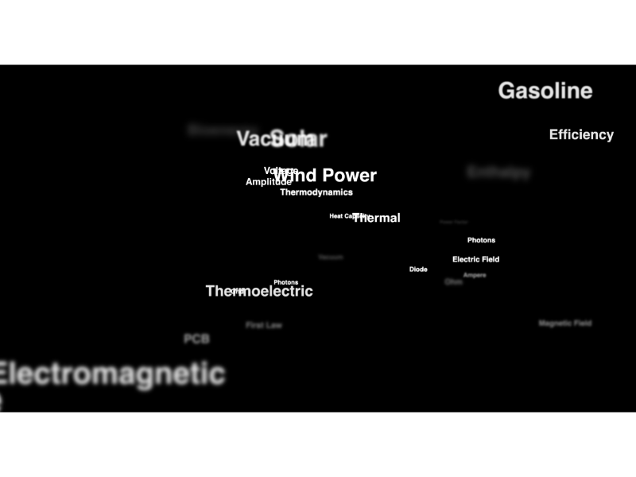
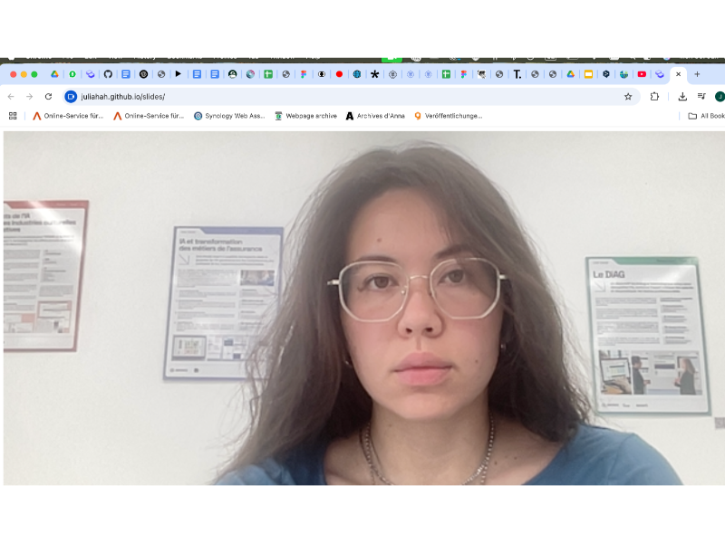
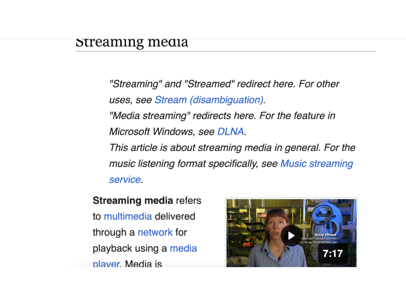
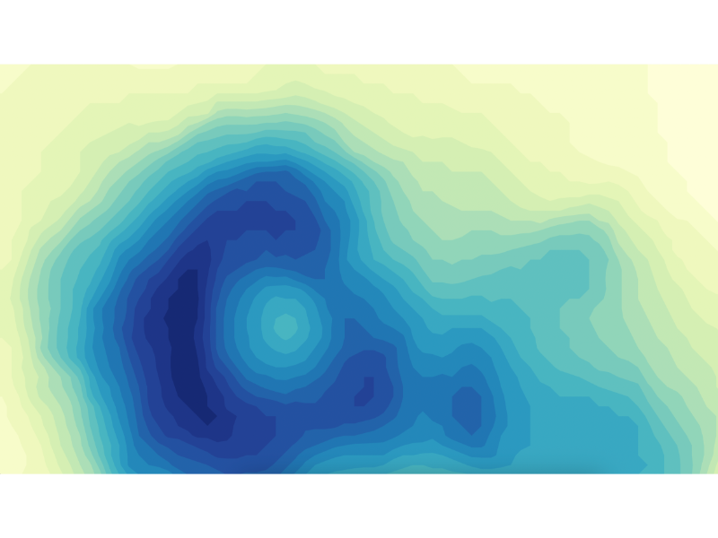
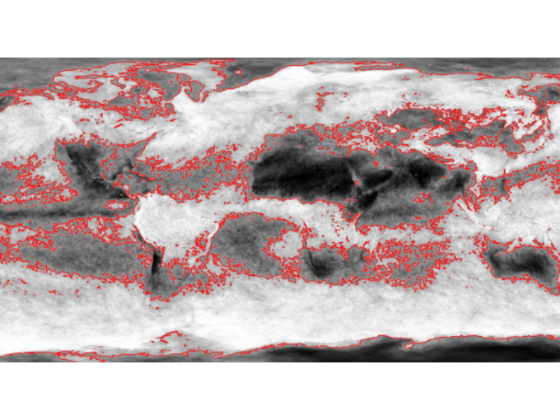
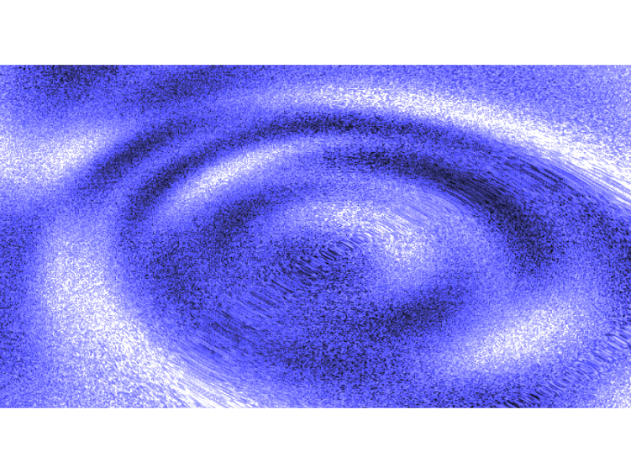
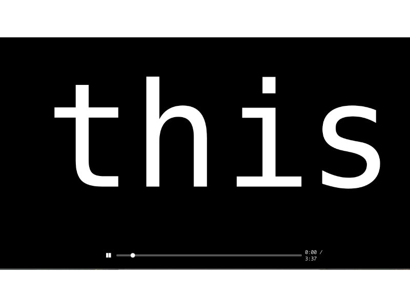
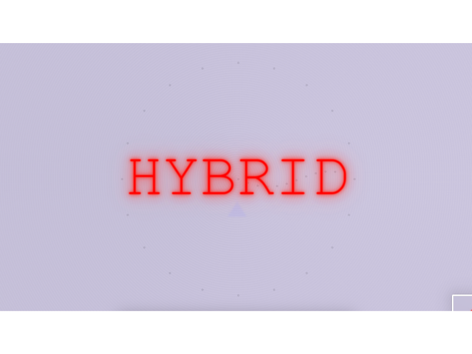

# Zero Net Types

List of Zero Net experiments including title, link, preview image, and a short description.

---

## ZERO 3D MODEL

An interactive 3D model integrated into Zero, allowing users to rotate, zoom, and explore objects or environments.

- **Link:** [https://disnovation.org/hydra/3D_01.html](https://disnovation.org/hydra/3D_01.html)

---

## ZERO KEYWORDS CLOUD

An immersive, scrollable word cloud experience where keywords dynamically flow across the screen, representing specific topics or themes.

- **Link:** [https://disnovation.org/slowframe/scroll/](https://disnovation.org/slowframe/scroll/)

---

## ZERO CAMERA INTEGRATION

Integrates the live camera feed into the experience, allowing users to see themselves in real time, with the option to apply filters, overlays, or visual modifications.

- **Link:** [https://juliahah.github.io/slides/](https://juliahah.github.io/slides/)

---

## ZERO COMPRESSED VIDEO

A transformation of standard video into ultra-low quality, heavily compressed, and pixelated form.

- **Link:** [https://disnovation.org/slowframe/video/video3.html](https://disnovation.org/slowframe/video/video3.html)

---

## ZERO EMBEDDED WEBSITE

Integrates external websites into Zero, allowing full interaction: scrolling, clicking links, copying text, and navigating pages.

- **Link:** [https://disnovation.org/slowframe/wiki-autoscroll.html](https://disnovation.org/slowframe/wiki-autoscroll.html)

---

## ZERO CONTOUR FLOW

An embedded contour-based graphic generated with D3.js. It displays layered, topographic shapes that suggest depth and density.

- **Link:** [https://juliahah.github.io/d3-contour_1/](https://juliahah.github.io/d3-contour_1/)

---

## ZERO CLOUD CONTOURS

A layered contour visualization with organic, cloud-like shapes created using D3.js.

- **Link:** [https://juliahah.github.io/d3_clouds/](https://juliahah.github.io/d3_clouds/)

---

## ZERO SYTH PATTERN

A purely code-generated noise visual created with Hydra, featuring evolving oscillating patterns and smooth animations driven by mathematical functions.

- **Link:** [https://www.youtube.com/watch?v=cMQJs9nDcEE](https://www.youtube.com/watch?v=cMQJs9nDcEE)

---

## ZERO TEXT ONLY

A format composed entirely of text, where font styles, pacing, and narration timing are creatively manipulated to convey meaning and rhythm without any other visual elements.

- **Link:** [https://disnovation.org/slowframe/1word/1word_novideo.html](https://disnovation.org/slowframe/1word/1word_novideo.html)

---

## ZERO TEXT-BASED ANIMATION

A text-based animation with ASCII elements, crafted with SRT timing logic, transforming characters into moving visuals.

- **Link:** [https://disnovation.org/slowframe/1word/ascii.html](https://disnovation.org/slowframe/1word/ascii.html)

---

## ZERO PICTURE BRUSH

A creative tool that lets you paint using images as brushes—allowing dynamic drawing with static pictures or live image queries.

- **Link:** [https://juliahah.github.io/brushPictures/](https://juliahah.github.io/brushPictures/)

---

## ZERO LOCALIZED MEDIA

Media content dynamically tailored to the user’s location, displaying real-time information such as current position, weather, and local time.

- **Link:** [https://juliahah.github.io/WeatherTime/](https://juliahah.github.io/WeatherTime/)

---

## ZERO MINIMAL FRAME

A low-resolution video animation that uses heavy blur and minimal frames per second to create a haunting, atmospheric storytelling experience.

- **Link:** [https://disnovation.org/slowframe/facefade/](https://disnovation.org/slowframe/facefade/)

---

## ZERO FLICKERING TEXT

Rapidly flickering text that displays words related to a specific topic, creating an intense, dynamic visual effect.

- **Link:** [https://juliahah.github.io/flickering-text/](https://juliahah.github.io/flickering-text/)

---

## ZERO MAP 2D

An interactive 2D mapping solution that enables users to zoom in on locations, pan across different areas, mark specific points of interest, and display geospatial data.

- **Link:** [https://juliahah.github.io/map2D/](https://juliahah.github.io/map2D/)

---

## ZERO MAP 3D

A 3D map offering immersive navigation through zooming, rotating, and flying across realistic terrain. Users can interact with the globe and visualize geospatial data in three dimensions.

- **Link:** [https://juliahah.github.io/map3D/](https://juliahah.github.io/map3D/)

---